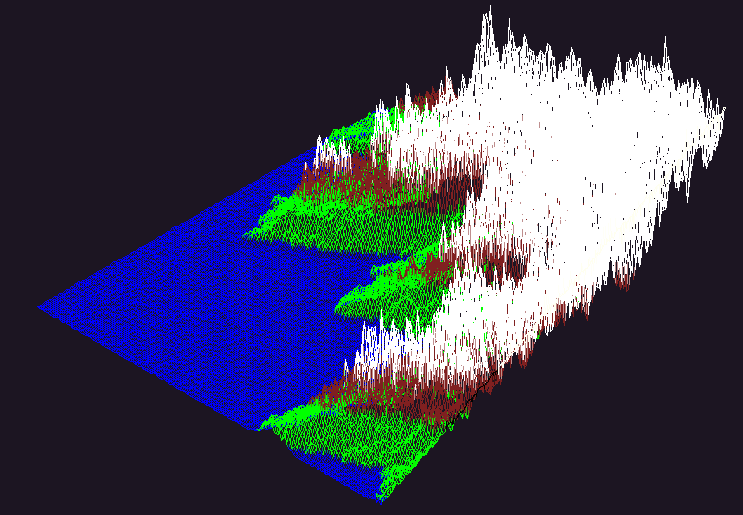
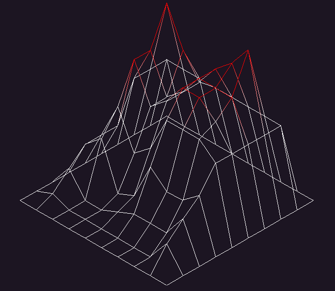
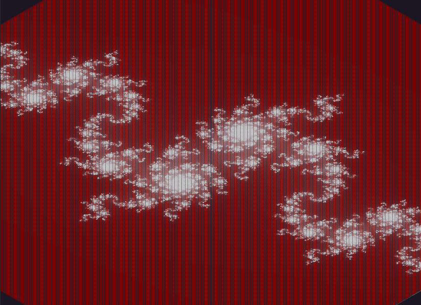
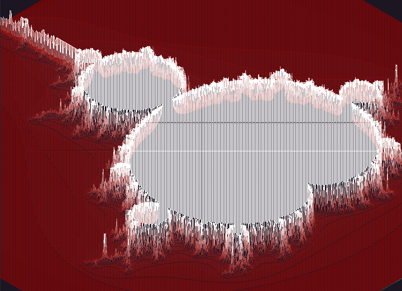

<h1 align="center"> FDF </h1>

_<h6 align="center">My first graphic project at 42 school!</h6>_

<p align="center">
<a href="./examples/42mod.png">
</p></a></p>

## Description

_This project is about creating a simple wireframe model representation of a 3D
landscape by linking various points (x, y, z) thanks to line segments (edges).
It's coded in C using [Minilibx](https://github.com/42Paris/minilibx-linux)._


## The project

### Input

FdF can create a 3D representation from a `.fdf` map file. The map consists in a square matrix of numbers formatted as it follows:

```txt
0  0  0  0  0  0  0  0  0  0  0  0  0  0  0  0  0  0  0
0  0  0  0  0  0  0  0  0  0  0  0  0  0  0  0  0  0  0
0  0 10 10  0  0 10 10  0  0  0 10 10 10 10 10  0  0  0
0  0 10 10  0  0 10 10  0  0  0 10 10 10 10 10 10  0  0
0  0 10 10  0  0 10 10  0  0  0  0  0  0  0 10 10  0  0
0  0 10 10 10 10 10 10  0  0  0  0 10 10 10 10 10  0  0
0  0  0 10 10 10 10 10  0  0  0 10 10 10 10 10  0  0  0
0  0  0  0  0  0 10 10  0  0  0 10 10  0  0  0  0  0  0
0  0  0  0  0  0 10 10  0  0  0 10 10 10 10 10 10  0  0
0  0  0  0  0  0 10 10  0  0  0  0 10 10 10 10 10  0  0
0  0  0  0  0  0  0  0  0  0  0  0  0  0  0  0  0  0  0
0  0  0  0  0  0  0  0  0  0  0  0  0  0  0  0  0  0  0
```
> - The model has the matrix size (rows and columns);
> - The value of an element represents the Z axis.

The map is rendered using [isometric projection](https://en.wikipedia.org/wiki/Isometric_projection) and [Bresenham's line algorithm](https://en.wikipedia.org/wiki/Bresenham%27s_line_algorithm) to draw lines.

Colors can be added after each element in hexadecimal format `0xFFFFFF` followed by a comma [(example)](./maps/42mod.fdf).

---

### Features and commands

**Translation** 
- Press `arrow keys` to move the map around;
- Or `hold and drag` using the `left button` (may cause lag).


**Rotation**

- Press `W` and `S` to rotate around the X-axis;
- Press `A`  and `D` to rotate around the Y-axis;
- Press `Q` and `E` to rotate around the Z-axis.
- Or `hold and drag` using the `right button` (may cause lag)


**Zoom**

- Press `+` or `scroll up` to zoom in;
- Press `-` or `scroll down` to zoom out.


**Z-axis**

- Press `.` or `shift` + `scroll up` to increase;
- Press `,` or `shift` + `scroll down` to descrease.


**Projection**

- Press `I` to alternate to isometric projection (default);
- Press `O` to alternate to ortografic projection;


**Reset**

- Press `R` to reset the position.
---

## Usage

### Requirements

FdF requires gcc compiler and standard c libraries.

### Compilation

Clone this repository in your project folder:

	$> git clone https://github.com/pedro-pn/fdf

Run `make` command in the repository folder:

	$> make

If you have trouble compiling FdF, have a look at [Minilibx requirements](https://github.com/42Paris/minilibx-linux).

Make supports the following rules:

> - `make`/`make all` - compiles the program;
> - `make clean` - removes all objects (`.o`) files;
> - `make fclean` - performs `clean` and also removes program's binary file(`fdf`);
> - `make re` - performs `fclean` and `all` recompiling the program.

### Use

Once compiled, the binary `fdf` is generated in the repository folder. Just execute passing a map to be rendered:

	$> ./fdf path/to/example.fdf

### Examples

**t1.fdf**



**elem-col.fdf**



**julia.fdf**



**elem-fract.fdf**



## References

- _https://en.wikipedia.org/wiki/Bresenham%27s_line_algorithm_
- _https://aurelienbrabant.fr/blog/pixel-drawing-with-the-minilibx#optional-alternative-implementation-of-img_pix_put_
- _https://harm-smits.github.io/42docs/_
- _https://yal.cc/understanding-isometric-grids/_
- _https://github.com/VBrazhnik/FdF/wiki/How-to-perform-isometric-transformations%3F_
- _https://www.middle-engine.com/blog/posts/2020/07/28/bresenhams-line-algorithm_
- _https://www.math.utah.edu/~treiberg/Perspect/Perspect.htm_
